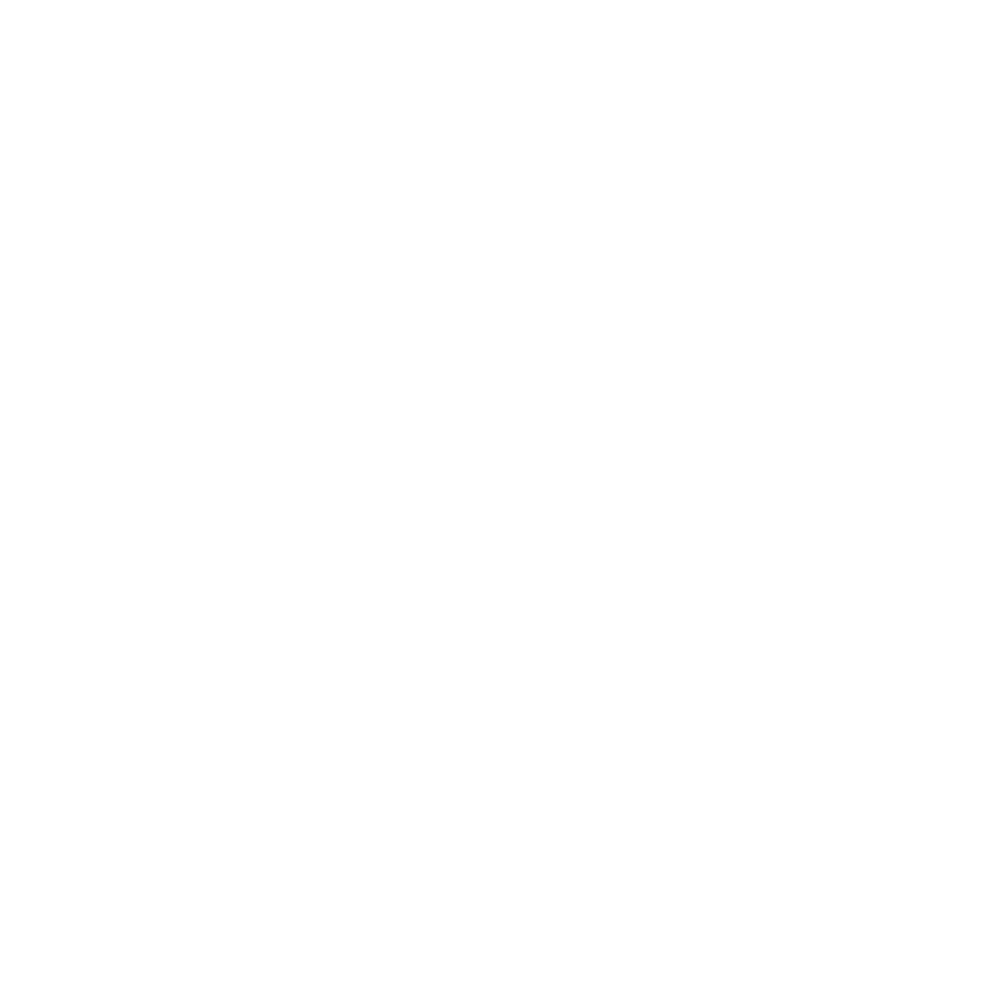
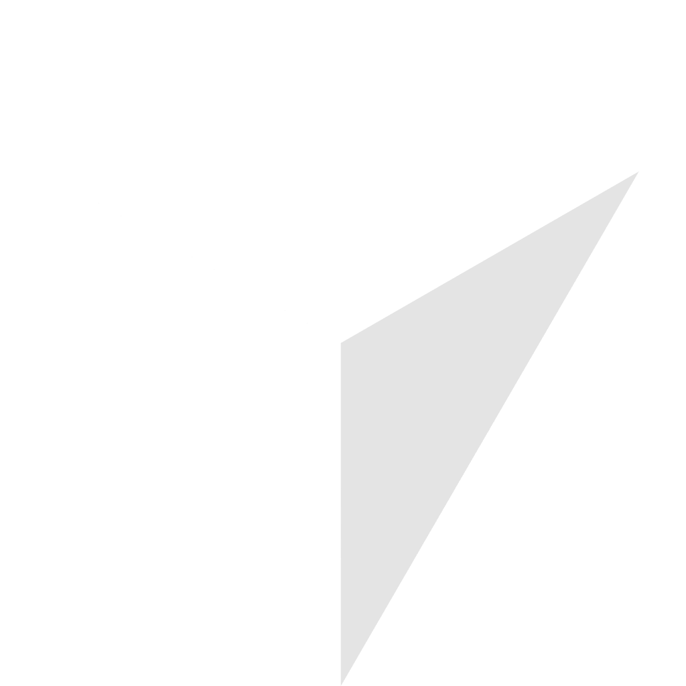
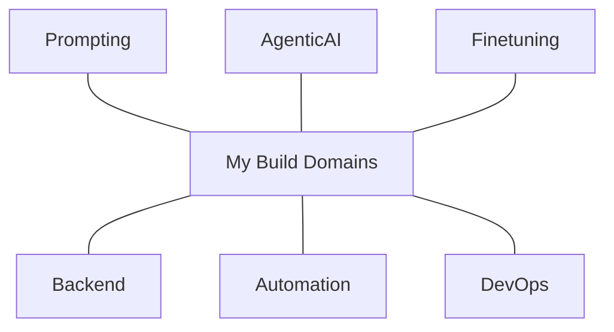

  

  ✨ <a href="https://www.vybecode.in/" target="_blank"><b>vybecode.in</b></a> — my corner of the internet.

  

  
  
  
  
  
  
  
  
  
  
  
  
  
  
  
  
  
  
  
  
  
  
  
  

###

  

  

###

  

###

<picture>
  <source media="(prefers-color-scheme: dark)" srcset="https://raw.githubusercontent.com/disastrousDEVIL/disastrousDEVIL/output/pacman-contribution-graph-dark.svg">
  <source media="(prefers-color-scheme: light)" srcset="https://raw.githubusercontent.com/disastrousDEVIL/disastrousDEVIL/output/pacman-contribution-graph.svg">
  
</picture>
